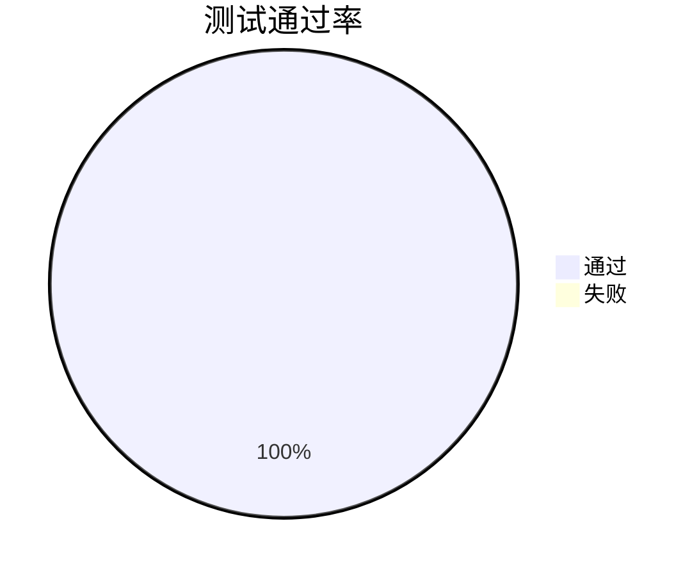

# 项目状态报告（2025-12-01）

## 摘要
- 分支：`master`；远程：`origin`（GitHub）
- 最近提交：`chore: 提交本地新增文件`、`init Repo`
- Pull Request：无开放/关闭 PR
- 本地测试：3/3 用例通过，授权用例耗时约 6.4ms
- 覆盖率：N/A（未集成覆盖率工具）
- CI/CD：未启用；本地运行流程已定义
- 依赖：`node:18-alpine`（已 EOL，需升级）、`python:3.11-slim`（在支持周期内）
- 健康度评估：中等（测试通过与文档基础良好；CI/覆盖率与依赖版本风险需尽快处理）

## 代码库状态
- 分支与状态：`git status -sb` 显示当前分支为 `master`，存在未跟踪目录 `.trae/`
- 远程：`origin https://github.com/rainchan/agno_home.git`
- 最近提交（最新 2 条）：
  - a9e32c4 chore: 提交本地新增文件
  - bd62877 init Repo
- 参考：README（/Users/rainbow/Haier/2-Projects/AIAgent/agno_home/README.md:1），Makefile（/Users/rainbow/Haier/2-Projects/AIAgent/agno_home/Makefile:1-14）

## Pull Request 状态
- Open：0
- Closed（最近）：0
- 说明：基于 GitHub API 查询当前仓库 PR 列表为空；后续如启用协作将以 CI 流水线自动校验。

## 构建与测试
- 运行方式：`make up`→`make test`→`make report`→`make down`
- 测试报告来源：`tests/reports/summary.json`（/Users/rainbow/Haier/2-Projects/AIAgent/agno_home/tests/reports/summary.json:1-35）
- 结果摘要：
  - TC-AUTH-01：passed，elapsed ≈ 6.4ms
  - TC-CTRL-02：passed
  - TC-STATE-01：passed
- 覆盖率：未集成（参考测试策略 docs/testing/test-strategy.md:16-23）

## CI/CD 流水线
- 文档策略：CI 可选启用，主张“本地优先”（/Users/rainbow/Haier/2-Projects/AIAgent/agno_home/docs/ci/pipeline.md:3-11；local-run.md:6-15）
- 当前状态：未检测到 `.github/workflows`，建议启用最小工作流：拉起 mocks→执行测试→产出报告 Artifact。

## 依赖管理与安全
- 运行镜像：
  - `node:18-alpine`（tests/docker-compose.yml:4-10）：已到 EOL，推荐升级至 `node:20` 或 `node:22` LTS。
  - `python:3.11-slim`（tests/docker-compose.yml:20-26）：仍在支持期。
- 锁定与扫描：暂无锁定文件与自动化漏洞扫描；建议接入 `trivy`/`docker scout`，按 PR/主分支触发并生成报告。

## 项目文档
- 已覆盖：路线图（docs/plans/roadmap.md）、测试策略（docs/testing/test-strategy.md）、CI 指南（docs/ci/*）、质量自评（docs/quality/self-review-checklist.md）等。
- 缺口：API/接口契约文档、架构说明与发布说明；建议补齐并与测试报告、提交记录建立追溯。

## 健康度评估
- 评分：中等（60/100）
- 依据：
  - + 本地测试稳定通过；文档框架完整
  - − CI 未启用、覆盖率空缺；依赖存在版本与安全风险

## 关键风险点
- 流水线缺失：无法自动化验证与阻断回归
- 覆盖率与门禁：质量度量缺位，发布风险偏高
- 依赖版本：`node:18` EOL；无漏洞扫描与版本锁定
- 文档缺口：接口契约与发布记录缺失，影响协作与追溯

## 优先级排序的下一步建议
1. 启用最小 CI 工作流（拉起 mocks→跑测试→上传报告）
2. 集成覆盖率并设定阈值门禁（核心≥90%、非核心≥80%）
3. 升级 Node 镜像至 LTS（20/22）并接入漏洞扫描
4. 补齐 API/接口契约与架构文档，统一发布说明模板
5. 建立任务清单与里程碑映射，纳入每日/提交前验证

## 资源分配评估
- 单人模式：约 0.5–1 天 完成 CI+报告初版；覆盖率与扫描再加 0.5 天
- 依赖升级：镜像与兼容性验证约 0.5 天

---

### 代码与配置参考位置
- Makefile：/Users/rainbow/Haier/2-Projects/AIAgent/agno_home/Makefile:1-14
- docker-compose：/Users/rainbow/Haier/2-Projects/AIAgent/agno_home/tests/docker-compose.yml:1-29
- 测试 Runner：/Users/rainbow/Haier/2-Projects/AIAgent/agno_home/tests/runner/run.py:48-56
- 测试报告：/Users/rainbow/Haier/2-Projects/AIAgent/agno_home/tests/reports/summary.json:1-35
- CI 文档：/Users/rainbow/Haier/2-Projects/AIAgent/agno_home/docs/ci/pipeline.md:3-21
- 测试策略：/Users/rainbow/Haier/2-Projects/AIAgent/agno_home/docs/testing/test-strategy.md:16-23
