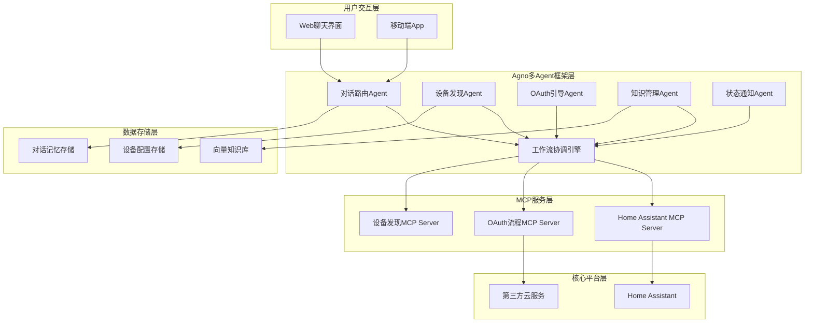
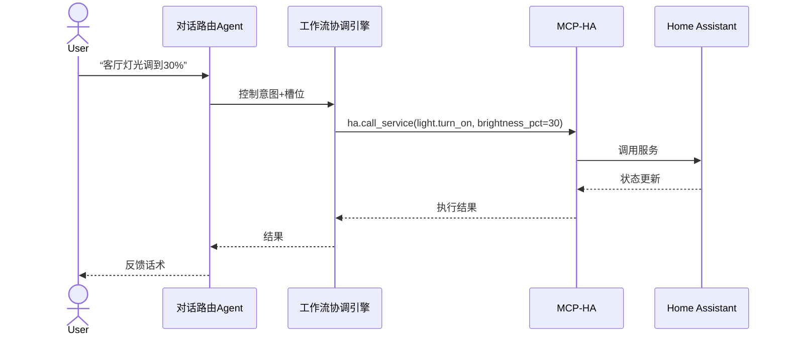
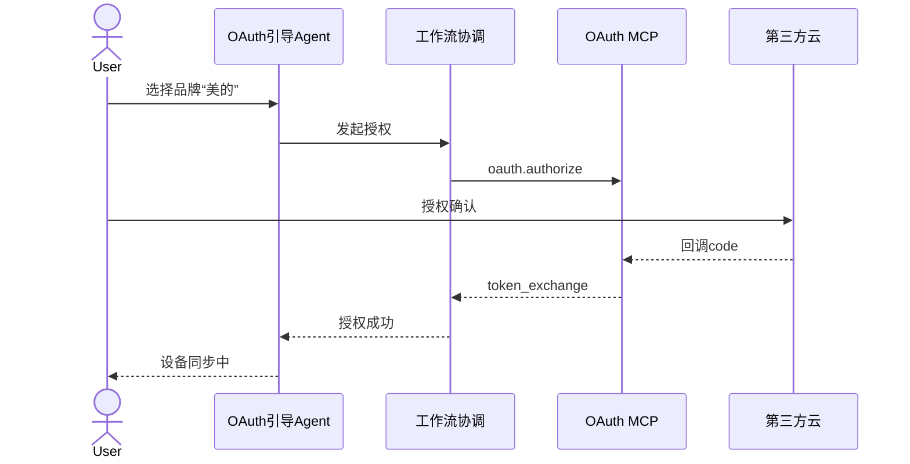
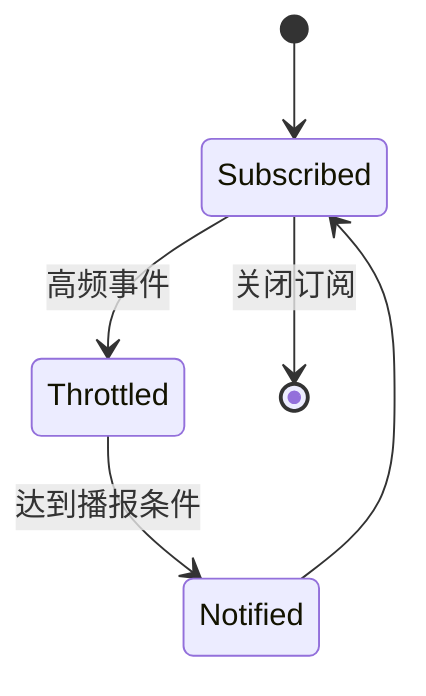

# 用户故事文档（HomeAssistant × Agno × MCP）

- 文档说明
  - 目的：将 MVP 需求转化为可执行、可测试、可追溯的用户故事集合
  - 范围：授权引导、意图与准入、设备控制、状态播报、设备发现与词典、知识问答、对话记忆
  - 结构：按模块组织；每个用户故事含背景、故事语句、验收标准、测试要点、技术建议、依赖、接口/数据、可视化、版本管理
  - 版本：v1.0（2025-11-28）
  - 当前状态：已确认

## 模块：授权引导（OAuth）

- 背景
  - 用户需接入不同品牌家电，通过 OAuth 完成账号授权并在 Home Assistant 映射为实体，避免在 HA 前端手动操作

### US-AUTH-01 选择品牌并发起 OAuth
- 用户故事
  - 作为普通用户，我想要在对话中选择品牌并发起授权，以便将该品牌设备接入 Home Assistant 并统一控制
- 业务规则/约束
  - 列表仅显示支持品牌；授权链接需包含状态参数避免 CSRF；回调需校验来源
- 验收标准（AC）
  - Given 用户在对话中表达授权品牌 When 系统列出可支持品牌 Then 用户选择品牌并收到授权跳转链接或内嵌流程
  - Given 用户点击授权 When 第三方回调完成 Then 系统显示授权进度及后续设备发现提示
- 测试要点
  - P0 功能：至少一种品牌授权可用；跳转与回调完整
  - P1 安全：状态参数与来源校验；Token 不记录到日志
  - P2 性能：列表显示与跳转启动时间 ≤1s
- 技术实现建议
  - Agent：E OAuth引导Agent；H 工作流协调引擎
  - MCP：J oauth.authorize(brand, scopes, redirect_uri)
- 依赖关系
  - 依赖 US-AUTH-02 的回调与 Token 交换
- 接口与数据
  - 请求示例：`{ "brand": "midea", "scopes": ["devices.read"], "redirect_uri": "https://app/callback" }`
  - 响应示例：`{ "auth_url": "https://oauth.midea.com/authorize?..." }`
- 可视化
  - 参见下文“OAuth 流程”图
- 版本管理
  - ID：US-AUTH-01；状态：已确认；追溯：提交 tags/auth, 用例 TC-AUTH-01

### US-AUTH-02 回调与 Token 交换成功落地
- 用户故事
  - 作为系统，我想要在回调后完成 Token 交换并存储，以便后续设备发现与控制可用
- 业务规则/约束
  - Token 加密存储与最小权限；支持定期轮换与刷新；错误需可恢复
- 验收标准（AC）
  - Given 回调返回 code When 调用 token_exchange Then 成功存储 access_token/refresh_token 并加密
  - Given Token 交换成功 When 通知设备发现 Then 用户在对话中收到“设备同步中”的提示
- 测试要点
  - P0 功能：code→token_exchange 成功；加密保存
  - P1 安全：最小权限；日志无敏感信息
  - P2 性能：交换耗时 ≤2s
- 技术实现建议
  - Agent：E；H
  - MCP：J oauth.token_exchange(code, client_info)
- 依赖关系
  - 前置 US-AUTH-01；后置 US-DISC-01
- 接口与数据
  - 请求：`{ "code": "auth_code_123", "client_info": { "id": "xxx", "secret": "yyy" } }`
  - 响应：`{ "access_token": "****", "refresh_token": "****", "expires_in": 3600 }`
- 版本管理
  - ID：US-AUTH-02；状态：已确认；追溯：提交 tags/oauth, 用例 TC-AUTH-02

### US-AUTH-03 授权失败重试与错误提示
- 用户故事
  - 作为普通用户，我想要在授权失败时获得明确提示与重试入口，以便尽快完成接入
- 业务规则/约束
  - 错误分类：网络/拒绝/回调失败/权限；提示不包含敏感数据
- 验收标准（AC）
  - Given 授权失败 When 原因可识别 Then 提示具体错误与重试步骤
  - Given 多次失败 When 网络异常 Then 提供离线指引或稍后重试建议
- 测试要点
  - P0 功能：覆盖常见错误并可重试
  - P1 安全：错误信息不泄露敏感数据
  - P2 兼容：移动端与 Web 一致
- 技术实现建议
  - Agent：E；C 路由提示话术
- 依赖关系
  - 依赖 US-AUTH-01/02 的流程状态
- 版本管理
  - ID：US-AUTH-03；状态：已确认；追溯：提交 tags/oauth-error, 用例 TC-AUTH-03

## 模块：对话意图与控制准入

- 背景
  - 用户自然语言不一定是设备控制；需正确分类意图，并在控制前进行准入校验和必要确认

### US-INTENT-01 分类意图（控制/查询/知识/闲聊）
- 用户故事
  - 作为系统，我想要将用户输入分类为控制/查询/知识/闲聊，以便路由到正确的处理流程
- 业务规则/约束
  - 设定意图置信阈值；低置信触发澄清；闲聊不触发控制
- 验收标准（AC）
  - Given 多样化输入 When 分类 Then 准确率在 MVP 话术集≥90%
  - Given 模糊输入 When 分类不确定 Then 标记低置信并触发澄清
- 测试要点
  - P0 功能：四类意图覆盖；置信度输出
  - P1 性能：分类时间 ≤400ms
  - P2 兼容：中英文混合/方言词汇容错
- 技术实现建议
  - Agent：C 对话路由；F 知识辅助；O 记忆增强
  - LLM：分类器 prompt/小型路由模型
- 依赖关系
  - 依赖 N 向量库与 P 词典
- 版本管理
  - ID：US-INTENT-01；状态：已确认；追溯：tags/intent, 用例 TC-INTENT-01

### US-INTENT-02 低置信度澄清与二次确认
- 用户故事
  - 作为系统，我想要在控制意图置信度不足时进行澄清或二次确认，以便避免误控
- 业务规则/约束
  - 澄清最多 2 回合；高风险操作必须二次确认
- 验收标准（AC）
  - Given 低置信度控制意图 When 询问澄清 Then 用户可补充空间/设备/功能
  - Given 高风险操作 When 执行前 Then 必须确认“是/否”
- 测试要点
  - P0 功能：澄清回合≤2次即可完成控制
  - P1 安全：默认不执行高风险操作
  - P2 易用：澄清话术简洁明确
- 技术实现建议
  - Agent：C；H 准入策略；G 通知回执
- 依赖关系
  - 前置 US-INTENT-01；后置 US-CTRL-01/02
- 版本管理
  - ID：US-INTENT-02；状态：已确认；用例 TC-INTENT-02

### US-INTENT-03 高风险操作的确认策略
- 用户故事
  - 作为系统，我想要对高风险控制（如长时开启、最大功率）进行确认，以便降低风险
- 业务规则/约束
  - 策略可配置；审计必记录
- 验收标准（AC）
  - Given 高风险匹配规则 When 触发 Then 强制二次确认并记录审计
- 测试要点
  - P0 安全：规则命中正确；审计落库
  - P1 功能：确认后执行；取消后不执行
- 技术实现建议
  - Agent：H 策略引擎；G 审计与通知
- 依赖关系
  - 依赖 P 策略配置
- 版本管理
  - ID：US-INTENT-03；状态：已确认；用例 TC-INTENT-03

## 模块：设备控制（空间/设备/功能/参数）

- 背景
  - 将用户话术槽位解析为具体实体与服务调用，通过 MCP→HA 实现控制并反馈

### US-CTRL-01 槽位解析（空间/设备/功能/参数）
- 用户故事
  - 作为系统，我想要从用户输入提取空间、设备、功能与参数，以便后续实体解析与调用
- 业务规则/约束
  - 若参数缺失需触发澄清；支持别名与同义词
- 验收标准（AC）
  - Given 常见话术 When 槽位抽取 Then 准确率≥90%
  - Given 缺失参数 When 抽取 Then 触发澄清
- 测试要点
  - P0 功能：覆盖灯/空调/插座
  - P1 性能：抽取时间 ≤400ms
- 技术实现建议
  - Agent：C；F 词典增强；O 记忆补全
- 依赖关系
  - 依赖 P 设备配置与 N 词典
- 版本管理
  - ID：US-CTRL-01；状态：已确认；用例 TC-CTRL-01

### US-CTRL-02 实体映射与服务调用
- 用户故事
  - 作为系统，我想要将槽位映射到 HA 实体并调用服务，以便完成实际控制
- 业务规则/约束
  - 冲突时要求用户选择；服务调用需返回 trace_id 便于追踪
- 验收标准（AC）
  - Given 槽位与词典 When 实体映射 Then 得到唯一 `entity_id` 或明确冲突
  - Given 映射成功 When 调用服务 Then 返回执行结果并在 3 秒内状态更新
- 测试要点
  - P0 功能：`light.turn_on`（`brightness_pct`）、`climate.set_temperature`
  - P1 兼容：空间维度→实体选择；别名解析
- 技术实现建议
  - MCP：I `ha.call_service(domain, service, payload)`
  - 请求示例：`{ "domain": "light", "service": "turn_on", "payload": { "entity_id": "light.living_main", "brightness_pct": 30 } }`
  - 响应示例：`{ "status": "ok", "trace_id": "abc123" }`
- 依赖关系
  - 前置 US-CTRL-01；后置 US-CTRL-03
- 版本管理
  - ID：US-CTRL-02；状态：已确认；用例 TC-CTRL-02

### US-CTRL-03 执行反馈与失败建议
- 用户故事
  - 作为普通用户，我想要在控制完成后得到明确反馈或可操作的失败建议，以便确认结果或自助处理
- 业务规则/约束
  - 反馈需包含关键参数与空间/设备名；失败提供建议与重试入口
- 验收标准（AC）
  - Given 执行成功 When 返回 Then 用自然语言反馈包含关键参数
  - Given 执行失败 When 返回 Then 提供原因与建议（如网络异常、权限不足）
- 测试要点
  - P0 功能：成功与失败话术；重试入口
  - P1 易用：话术清晰，可复述变更
- 技术实现建议
  - Agent：C；G 通知播报
- 版本管理
  - ID：US-CTRL-03；状态：已确认；用例 TC-CTRL-03

## 模块：状态自动上报

- 背景
  - 订阅 HA 事件，进行节流与合并，按优先级播报

### US-STATE-01 订阅设备状态变更
- 用户故事
  - 作为系统，我想要订阅设备状态变更事件，以便主动播报给用户
- 业务规则/约束
  - 订阅使用 WebSocket；断线自动重连；关键设备优先
- 验收标准（AC）
  - Given WebSocket 可用 When 订阅 `state_changed` Then 接收事件并记录
- 测试要点
  - P0 功能：事件接收与解析
  - P1 性能：播报延迟 ≤3s
- 技术实现建议
  - MCP：I `ha.subscribe_events(event_type)`；`ha.query_state(entity_id)`
- 版本管理
  - ID：US-STATE-01；状态：已确认；用例 TC-STATE-01

### US-STATE-02 播报节流与合并策略
- 用户故事
  - 作为系统，我想要对高频事件进行节流与合并，以便避免骚扰用户
- 业务规则/约束
  - 节流阈值可配置；同一设备合并播报
- 验收标准（AC）
  - Given 高频事件 When 节流 Then 不超过设定频率
  - Given 多事件同一设备 When 合并 Then 生成一次综合话术
- 测试要点
  - P0 功能：节流生效；合并策略正确
  - P1 易用：话术清晰
- 技术实现建议
  - Agent：G 状态通知；H 协调
- 版本管理
  - ID：US-STATE-02；状态：已确认；用例 TC-STATE-02

### US-STATE-03 异常状态提醒（安全优先）
- 用户故事
  - 作为系统，我想要在异常或安全相关事件发生时优先提醒，以便用户及时处理
- 业务规则/约束
  - 安全规则优先级最高；需审计记录
- 验收标准（AC）
  - Given 安全事件规则 When 命中 Then 立即播报并高亮提示
- 测试要点
  - P0 安全：规则命中准确；不遗漏
- 技术实现建议
  - Agent：G；策略存储 P
- 版本管理
  - ID：US-STATE-03；状态：已确认；用例 TC-STATE-03

## 模块：设备发现与词典管理

- 背景
  - 聚合设备发现，维护空间/实体映射与别名词典，提升解析准确率

### US-DISC-01 周期发现与配置存储刷新
- 用户故事
  - 作为系统，我想要定期扫描并刷新设备配置存储，以便保持实体映射最新
- 业务规则/约束
  - 扫描频率可配置；变更记录需审计
- 验收标准（AC）
  - Given 定时任务 When 执行 Then 更新 `P 设备配置存储` 并记录差异
- 测试要点
  - P0 功能：发现输出标准化；存储更新成功
  - P1 性能：扫描耗时 ≤5s/100设备
- 技术实现建议
  - MCP：K `discovery.scan(filters)`；写 P
- 版本管理
  - ID：US-DISC-01；状态：已确认；用例 TC-DISC-01

### US-DISC-02 别名与空间词典维护
- 用户故事
  - 作为普通用户，我想要维护设备别名与空间词典，以便更自然的对话控制
- 业务规则/约束
  - 别名唯一；冲突检测与提示；支持同义词
- 验收标准（AC）
  - Given 用户设置别名 When 保存 Then 在解析时生效
- 测试要点
  - P0 功能：别名 CRUD；冲突检测
  - P1 易用：提示与回显清晰
- 技术实现建议
  - Agent：D 设备发现；F 知识管理；存储 P/N
- 版本管理
  - ID：US-DISC-02；状态：已确认；用例 TC-DISC-02

### US-DISC-03 向量知识库嵌入更新
- 用户故事
  - 作为系统，我想要将设备词典与品牌说明嵌入到向量知识库，以便提升检索与解析
- 业务规则/约束
  - 批处理与队列；失败重试
- 验收标准（AC）
  - Given 词典更新 When 嵌入刷新 Then 知识检索可用且相关性提升
- 测试要点
  - P1 性能：嵌入批处理耗时可控
- 技术实现建议
  - Agent：F；存储 N
- 版本管理
  - ID：US-DISC-03；状态：已确认；用例 TC-DISC-03

## 模块：知识问答

- 背景
  - 为用户提供品牌与设备能力说明、来源提示与使用建议

### US-KB-01 品牌/设备能力检索与回答
- 用户故事
  - 作为普通用户，我想要查询特定设备的能力与用法，以便正确操作
- 业务规则/约束
  - 提供关键参数与限制；答案简洁可读
- 验收标准（AC）
  - Given 查询问题 When 检索 Then 返回答案与关键参数
- 测试要点
  - P0 功能：检索准确；答案可读
- 技术实现建议
  - Agent：F 知识管理；N 向量库；C 路由
- 版本管理
  - ID：US-KB-01；状态：已确认；用例 TC-KB-01

### US-KB-02 来源与可信度提示
- 用户故事
  - 作为普通用户，我想要看到答案的来源与可信度，以便判断可靠性
- 业务规则/约束
  - 显示来源摘要与可信度分；不可伪造来源
- 验收标准（AC）
  - Given 回答 When 返回 Then 显示来源摘要与可信度分
- 测试要点
  - P1 易用：来源清晰；分值合理
- 技术实现建议
  - Agent：F；N
- 版本管理
  - ID：US-KB-02；状态：已确认；用例 TC-KB-02

## 模块：对话记忆

- 背景
  - 保存用户偏好与上下文，提升连续对话中的解析与控制准确率

### US-MEM-01 偏好与上下文记忆写入/读取
- 用户故事
  - 作为系统，我想要存取用户偏好与近期上下文，以便在后续对话中自动补全
- 业务规则/约束
  - 记忆设定过期策略；隐私与删除能力
- 验收标准（AC）
  - Given 偏好设定 When 写入 Then 在解析时被引用
- 测试要点
  - P0 功能：写/读一致；过期策略
- 技术实现建议
  - 存储：O 对话记忆；Agent：C
- 版本管理
  - ID：US-MEM-01；状态：已确认；用例 TC-MEM-01

### US-MEM-02 连续对话解析增强
- 用户故事
  - 作为系统，我想要利用记忆增强连续对话解析，以便减少重复澄清
- 业务规则/约束
  - 在不显著增加延迟的前提下提升准确率
- 验收标准（AC）
  - Given 上下文存在 When 解析 Then 准确率提升并减少澄清次数
- 测试要点
  - P1 性能：不显著增加延迟
- 技术实现建议
  - Agent：C；O
- 版本管理
  - ID：US-MEM-02；状态：已确认；用例 TC-MEM-02

## 模块可视化（Mermaid）

- 架构分层

- 控制流程

- OAuth 流程

- 状态播报状态图

## 接口与数据格式（规范）

- MCP/HA
  - `ha.call_service`
    - 请求：`{ "domain": "light", "service": "turn_on", "payload": { "entity_id": "light.living_main", "brightness_pct": 30 } }`
    - 响应：`{ "status": "ok", "trace_id": "abc123" }`
  - `ha.query_state`
    - 请求：`{ "entity_id": "climate.bedroom_ac" }`
    - 响应：`{ "state": "heat", "attributes": { "temperature": 26 } }`
  - `ha.subscribe_events`
    - 请求：`{ "event_type": "state_changed" }`
    - 事件：`{ "entity_id": "light.living_main", "old_state": {...}, "new_state": {...}, "time_fired": "..." }`
- OAuth
  - `oauth.authorize`
    - 请求：`{ "brand": "midea", "scopes": ["devices.read"], "redirect_uri": "https://app/callback" }`
    - 响应：`{ "auth_url": "https://..." }`
  - `oauth.token_exchange`
    - 请求：`{ "code": "auth_code", "client_info": { "id": "xxx", "secret": "yyy" } }`
    - 响应：`{ "access_token": "****", "refresh_token": "****", "expires_in": 3600 }`
- 设备发现
  - `discovery.scan`
    - 响应：`[{ "device_id": "dev123", "area": "living_room", "entities": [{ "entity_id": "light.living_main", "domain": "light", "capabilities": ["on_off","brightness"] }]}]`

## 测试指导（总则）

- 测试类型与优先级
  - 功能：P0 必测；性能/安全/兼容：P1/P2 视模块
- 测试数据准备
  - 设备清单与空间命名；至少一类灯与空调
  - OAuth 测试账号与回调环境；网络异常模拟
- 环境
  - 本地 Docker，HA API/WebSocket 可用；MCP 服务联通
- 结果记录
  - 用例 ID 与实际结果；缺陷单与修复追踪

## 版本管理（规范）

- Story ID：`US-<模块简称>-<序号>`
- 状态：待评审/已确认/开发中/已完成（本稿均为“已确认”）
- 变更历史：日期、变更人、变更点、影响范围
- 追溯关系：代码标签/分支、相关接口、测试用例 ID

## 变更历史

- 2025-11-28：初稿创建，覆盖 7 模块共 17 个用户故事；状态设为“已确认”；作者：系统

